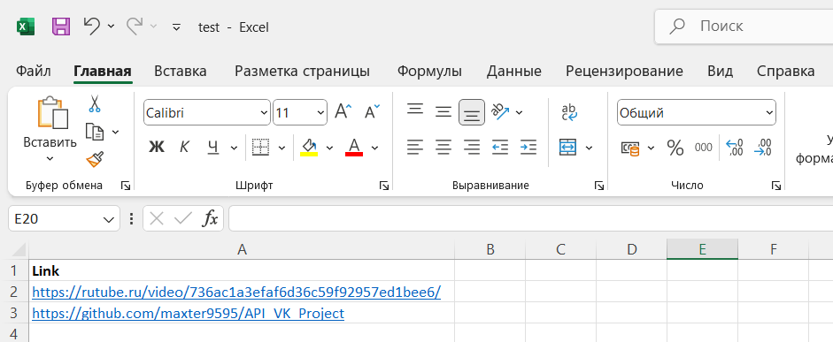
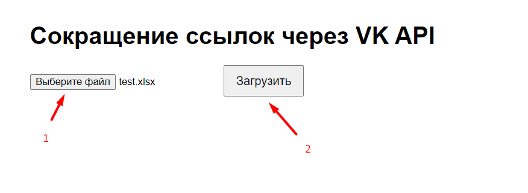
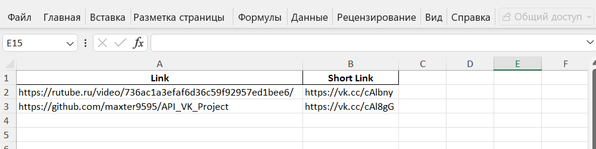

# Проектная работа «Автоматический сокращатель ссылок» (VK API)


## Цель проекта

Разработка программы для сокращения длинных ссылок путем задействования VK API (метод utils.getShortLink)


## Алгоритм запуска проекта


1. Настройте виртуальное окружение и подключитесь к нему:
   - ``venv\Scripts\activate`` - для Windows
   - ``source venv/bin/activate`` - для MacOS и Linux
```bash
python -m venv venv
venv\Scripts\activate
```


2. Установите зависимости:
```bash
pip install -r requirements.txt
```


3. Заполните следующие параметры в .env:
- ```VK_ACCESS_TOKEN```: токен для работы с VK API
- ```OUTPUT_FILE_NAME```: название xlsx файла, который необходимо вывести
- ```NEW_COL_NAME```: название нового столбца, содержащего укороченные ссылки


4. Запустите программу модуля app.py: 
```bash
python app.py
```

5. Перейдите по ссылке http://127.0.0.1:5000 или запустите сервис на облачной машине 


6. Подготовьте файл для обработки. Внешне его содержимое должно выглядеть примерно так:



7. После перехода на сайт веб-приложения: 1) нажмите на кнопку "Выберите файл" и выберите файл из пункта №6 для обработки; 2) нажмите на кнопку "Загрузить"



8. Ждите результат. В итоге должен загрузиться файл со следующей структурой:

